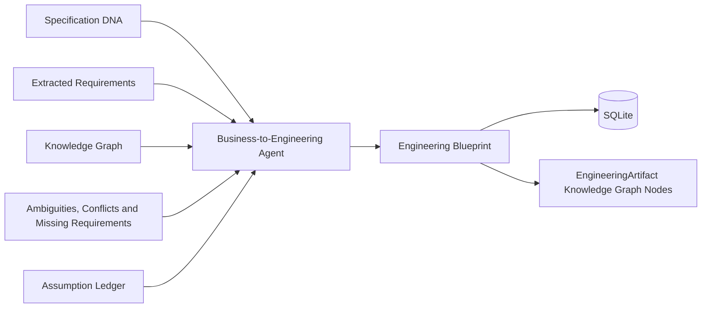
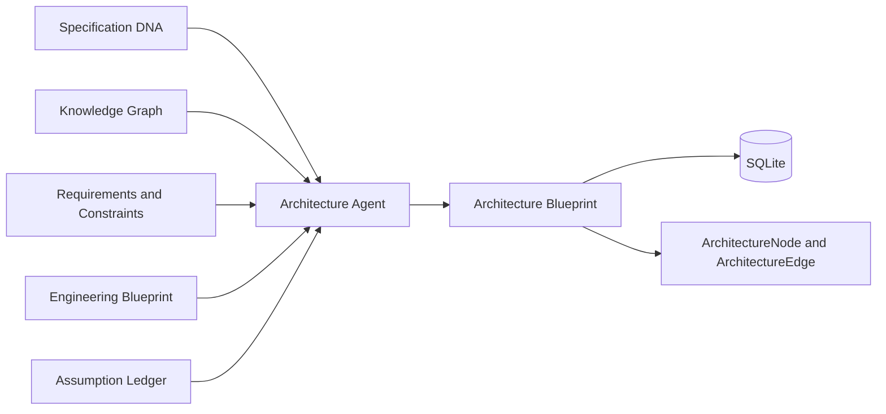
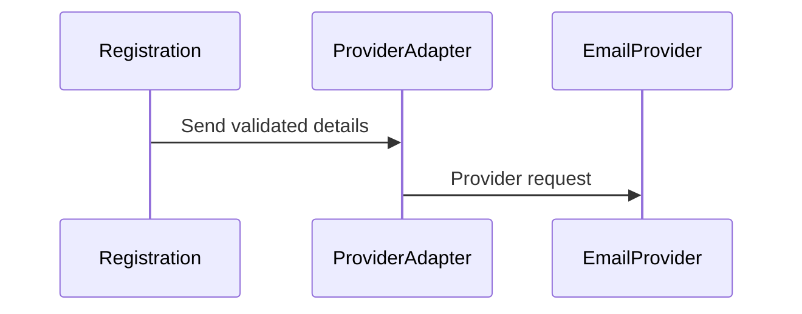

# SpecBridge AI

SpecBridge AI is a domain-agnostic AI Specification Intelligence Platform that turns messy business requirements into structured, engineering-ready outputs.

The current milestone provides the application scaffold plus validated document upload, local storage, and deterministic text extraction. AI agents, chunking, embeddings, vector search, and specification generation are intentionally out of scope.

## Product vision

Teams often receive requirements through incomplete documents, meeting notes, tickets, spreadsheets, and conversations. SpecBridge AI will provide a governed workflow for interpreting those inputs, finding ambiguity and gaps, and producing traceable artifacts that engineering teams can use with confidence.

The platform is designed to remain domain-agnostic while supporting domain-specific prompts, policies, validation rules, and output formats.

## Architecture overview

```text
Streamlit frontend
        |
        v
FastAPI application
  ├── API routes
  ├── Core configuration
  ├── Domain models
  ├── Services
  ├── Future agent orchestration
  ├── Future document parsers
  ├── Future vector store adapters
  └── Future exporters and prompts
```

- `app/api/`: HTTP routes and API composition
- `app/agents/`: future AI agent orchestration
- `app/core/`: application configuration and shared infrastructure
- `app/models/`: typed request, response, and domain models
- `app/services/`: application use cases and business services
- `app/parsers/`: format-specific text extraction adapters
- `app/vectorstore/`: future vector store abstractions
- `app/exporters/`: future engineering artifact exporters
- `app/prompts/`: future versioned prompt assets
- `app/tests/`: backend tests
- `frontend/`: Streamlit user interface
- `samples/`: future example inputs and outputs
- `docs/`: architecture and product documentation
- `data/uploads/`: ignored local storage for successfully parsed uploads

## Document upload

`POST /upload` accepts one multipart file in the `file` field.

Supported formats:

- PDF (`.pdf`) - text-based PDFs; OCR is not included
- Word (`.docx`)
- Plain text (`.txt`, UTF-8)
- Markdown (`.md`, `.markdown`, UTF-8)
- Excel (`.xlsx`)
- CSV (`.csv`, UTF-8)

The endpoint validates the filename, extension, content type, file signature where applicable, non-empty content, and the configured size limit. A file is stored under `data/uploads/` only after parsing succeeds.

Example:

```bash
curl -X POST http://localhost:8000/upload \
  -H "accept: application/json" \
  -F "file=@samples/sample.pdf"
```

The response includes document metadata, a generated storage key, and the extracted text.

## Semantic chunking

Every successfully parsed upload is chunked by document meaning and structure rather than by a fixed token count. Supported chunk boundaries include:

- heading and subheading sections
- requirement blocks
- tables
- business rules
- acceptance criteria
- workflows

Each chunk is stored in local ChromaDB with:

- `document_id`
- `page`
- `heading`
- `section`
- `chunk_type`
- `chunk_number`

The current milestone deliberately makes no LLM or embedding-model calls. Chroma records receive a deterministic local hash vector so text and metadata can be persisted without downloading or invoking a model. A real embedding provider can replace this adapter in the next milestone.

The upload response includes `chunk_statistics`. Statistics can also be retrieved with:

```bash
curl http://localhost:8000/documents/{document_id}/chunks/statistics
```

The visualization endpoint returns frontend-ready document/chunk nodes and `contains`/`next` edges:

```bash
curl http://localhost:8000/documents/{document_id}/chunks/visualization
```

## Spec Health Dashboard

The dashboard calculates deterministic 0-100 readiness scores from the stored
requirements, ambiguities, conflicts, assumptions, engineering translation,
architecture recommendations, and traceability matrix. No additional LLM call
is made for scoring.

Scores include clarity, completeness, consistency, technical readiness,
architecture readiness, missing-information coverage, dependency readiness,
edge-case coverage, and weighted overall health. Higher is better for every
score; a `100` for Missing Information means no material information gaps were
detected.

Retrieve the dashboard JSON:

```bash
curl http://localhost:8000/spec-health/{document_id}
```

For free local UI and workflow testing, enable mock mode:

```dotenv
MOCK_AI=true
OPENAI_API_KEY=
```

Mock mode makes no external model calls. Its dashboard scores are explicitly
labeled structural demo estimates and must not be treated as real specification
analysis. Set `MOCK_AI=false` to restore the complete AI-backed pipeline.

Open the Streamlit dashboard and paste the `document_id` returned by upload:

```bash
streamlit run frontend/app.py
```

## Specification Knowledge Graph

Build a deterministic, SQLite-backed internal knowledge model from the stored
semantic chunks:

```bash
curl -X POST http://localhost:8000/knowledge/build/{document_id}
curl http://localhost:8000/knowledge/{document_id}
curl http://localhost:8000/knowledge/graph/{document_id}
```

The graph uses typed Pydantic entities, normalized SQLite tables, and a
NetworkX `MultiDiGraph`. It makes no LLM calls. Extraction is conservative and
preserves source chunk provenance and confidence on every entity and
relationship. See [`docs/knowledge-graph.md`](docs/knowledge-graph.md).

## Generic AI Agent Framework

Future business capabilities can plug into the reusable `BaseAgent` contract.
The framework provides auto-discovery, dependency-aware sequential pipelines,
conditions, retries, DNA-keyed SQLite caching, execution history, and durable
event logging. It contains no business-agent logic in this sprint.

See [`docs/agent-framework.md`](docs/agent-framework.md).

## Specification DNA

The first production framework agent analyzes the complete specification and
stores evidence-grounded Specification DNA. Every extracted project concept
includes confidence, exact source chunk IDs, and source document sections.

```bash
curl http://localhost:8000/specification-dna/{document_id}
```

Use `force_refresh=true` to bypass stored and framework cache entries. The agent
does not generate user stories, APIs, architecture, or missing information.

See [`docs/specification-dna.md`](docs/specification-dna.md) and
[`samples/specification-dna.example.json`](samples/specification-dna.example.json).

## Specification Understanding Agent

The first AI stage analyzes the complete ordered chunk set before downstream agents run. It returns validated structured JSON containing:

- document type or category
- project summary
- business objectives
- stakeholders
- human and system actors
- modules
- workflows
- integrations
- business rules
- constraints
- explicitly stated assumptions

It intentionally does not generate user stories, APIs, schemas, or implementation plans.

Configure the provider:

```dotenv
OPENAI_API_KEY=your-api-key
OPENAI_UNDERSTANDING_MODEL=gpt-5.5
UNDERSTANDING_CACHE_DB=data/specbridge.db
```

Run the agent after uploading a document:

```bash
curl -X POST \
  http://localhost:8000/documents/{document_id}/understanding
```

Results are cached in SQLite using the document's complete chunk fingerprint, model, and prompt version. A repeated request returns `"cached": true`. To deliberately rerun the analysis:

```bash
curl -X POST \
  "http://localhost:8000/documents/{document_id}/understanding?force_refresh=true"
```

## Requirement Extraction Agent

`RequirementExtractionAgent` is a domain-agnostic framework analysis agent. It
extracts functional, non-functional, business-rule, validation, access,
integration, data, reporting, notification, and explicit compliance/security
requirements.

Every requirement includes confidence, exact source chunks and section,
verbatim evidence, explicit/inferred provenance, ambiguity status, and missing
information status. Evidence text is validated against the cited chunks before
storage.

Run extraction:

```bash
curl -X POST http://localhost:8000/agents/requirements/{document_id}
```

Retrieve all stored requirements or one requirement:

```bash
curl http://localhost:8000/requirements/{document_id}
curl http://localhost:8000/requirements/{document_id}/{requirement_id}
```

Results are persisted in normalized SQLite tables and enrich the Knowledge
Graph with requirement nodes and evidence-based links to sections, actors,
workflows, integrations, and business rules.

Example:
[`samples/outputs/requirement_extraction_sample.json`](samples/outputs/requirement_extraction_sample.json).

## Ambiguity Detection Agent

The ambiguity agent analyzes every stored requirement and detects only grounded specification problems:

- vague language
- missing actors
- missing validations
- undefined business rules
- missing edge cases
- missing error handling
- undefined integrations

Every requirement receives an assessment, including an empty issue list when no supported ambiguity is found. Each issue includes:

- issue and requirement IDs
- source chunk
- issue type
- severity
- confidence
- grounded reason
- clarification question
- recommended stakeholder role

The service rejects incomplete requirement coverage, duplicate issue IDs, mismatched requirements, and invalid source-chunk references before storing results in SQLite.

Configure:

```dotenv
OPENAI_AMBIGUITY_MODEL=gpt-5.5
```

Run:

```bash
curl http://localhost:8000/ambiguities/{document_id}
```

Use `force_refresh=true` to bypass the cached result.

## Assumption Ledger

`AssumptionLedgerAgent` creates a dedicated, domain-agnostic ledger that keeps
document-backed facts strictly separate from AI-inferred assumptions. This
prevents provisional interpretations from silently becoming specification
truth.

Each assumption records:

- type, reason, confidence, impact area, and risk
- source chunks and source sections
- linked requirement, ambiguity, conflict, and missing-requirement IDs
- whether stakeholder confirmation is required
- a specific confirmation question
- status: `open`, `confirmed`, or `rejected`

Facts require verbatim source evidence. Assumptions require contextual
traceability and are always created with `open` status. Only the status endpoint
can confirm or reject them. Fully supported statements are rejected if they are
also returned as assumptions.

The agent analyzes Specification DNA, requirements, ambiguities, conflicts,
missing requirements, workflows, actors, integrations, business rules, and
constraints. Results and relationship links are stored in normalized SQLite
tables. The Knowledge Graph is enriched with `Assumption` nodes and related
entity links.

Configure:

```dotenv
OPENAI_ASSUMPTION_MODEL=gpt-5.5
```

Run:

```bash
curl -X POST http://localhost:8000/agents/assumptions/{document_id}
curl http://localhost:8000/assumptions/{document_id}
curl http://localhost:8000/assumptions/{document_id}/{assumption_id}
curl -X PATCH http://localhost:8000/assumptions/{document_id}/{assumption_id} \
  -H "Content-Type: application/json" \
  -d '{"status":"confirmed"}'
```

Use `force_refresh=true` on the POST endpoint to bypass cached output.

Example:
[`samples/outputs/assumption_ledger_sample.json`](samples/outputs/assumption_ledger_sample.json).

## Business-to-Engineering Translation Agent

`BusinessToEngineeringTranslationAgent` is the framework generation agent that
turns each extracted business requirement into an Engineering Blueprint. It
generates engineering specifications, never source code.

Blueprint artifacts include engineering summaries, user stories, measurable
acceptance criteria, backend and integration tasks, suggested REST APIs,
database entities, engineering business rules, edge cases, failure scenarios,
security and performance considerations, technical risks, and open questions.

Every artifact contains its requirement ID, artifact type, confidence, source
chunks and sections, upstream assumption/ambiguity/conflict/missing-requirement
links, and a calculated traceability score.

Provenance is explicit:

- `document_backed` requires verbatim source evidence.
- `ai_suggestion` is a non-binding engineering proposal with a reason.
- `ai_assumption` requires an existing confirmed Assumption Ledger ID.
- `needs_clarification` produces an open question instead of invented details.

Open or rejected assumptions cannot become settled engineering behavior. API
fields, database attributes, permissions, failure behavior, limits, and
technical controls are not invented when the source is incomplete.

Pipeline:



Example input:

```json
{
  "requirement_id": "INT-001",
  "description": "The registration workflow sends validated account details to Email Provider.",
  "source_chunk_ids": ["document-id:9"],
  "source_section": "3.1"
}
```

Configure:

```dotenv
OPENAI_TRANSLATOR_MODEL=gpt-5.5
```

Run:

```bash
curl -X POST \
  http://localhost:8000/agents/business-to-engineering/{document_id}
curl http://localhost:8000/engineering/{document_id}
curl http://localhost:8000/engineering/{document_id}/{artifact_id}
```

Use `force_refresh=true` on the POST endpoint to bypass cached output.

Example Engineering Blueprint:
[`samples/outputs/engineering_blueprint_sample.json`](samples/outputs/engineering_blueprint_sample.json).

## Architecture Recommendation Agent

`ArchitectureRecommendationAgent` is the framework generation agent that turns
the Engineering Blueprint into a production-oriented Architecture Blueprint.
It provides Architecture-as-a-Service without generating implementation code.

It recommends the simplest evidence-supported style among monolith, modular
monolith, microservices, event-driven, serverless, or hybrid, and explains why.
It also covers inferred logical modules, service responsibilities, database
ownership and access patterns, integrations, communication, identity and
access, caching, messaging, observability, deployment, scalability,
reliability, and security.

Infrastructure is never added merely because it is popular. Kubernetes,
brokers, caches, authentication mechanisms, database types, and cloud services
must be supported by requirements or Engineering Blueprint evidence. Missing
decisions are returned as `Needs clarification`.

Each recommendation includes requirement IDs, Engineering Blueprint artifact
IDs, assumption IDs where applicable, source chunks and sections, confidence,
rationale, provenance, and a calculated traceability score.

Pipeline integration:



Five Mermaid views are generated:

- system context
- component
- container
- sequence
- module dependency

Example Mermaid output:



Run:

```bash
curl -X POST http://localhost:8000/agents/architecture/{document_id}
curl http://localhost:8000/architecture/{document_id}
curl http://localhost:8000/architecture/{document_id}/diagram
```

Use `force_refresh=true` on the POST endpoint to bypass cached output.

Example:
[`samples/outputs/architecture_blueprint_sample.json`](samples/outputs/architecture_blueprint_sample.json).

Configure:

```dotenv
OPENAI_ARCHITECTURE_MODEL=gpt-5.5
```

## Developer Copilot

Developers can ask questions about an uploaded specification. The copilot answers using only:

- original specification chunks
- extracted requirements and business rules
- stored architecture recommendations

It does not use general knowledge, assumptions, ambiguity findings, conflict findings, specification summaries, or generated engineering artifacts.

Every available answer includes source chunk citations, with optional requirement and architecture recommendation IDs. If the allowed sources cannot support an answer, the response is exactly:

```text
Not enough information.
```

and includes a specific clarification question.

Configure:

```dotenv
OPENAI_COPILOT_MODEL=gpt-5.5
```

Ask:

```bash
curl -X POST http://localhost:8000/copilot/{document_id}/ask \
  -H "Content-Type: application/json" \
  -d '{"question":"What validation is required for customer email?"}'
```

Copilot interactions and citations are stored in SQLite.

## Complete Traceability Matrix

The traceability service deterministically connects:

```text
Business Requirement
  -> User Story
  -> API
  -> Database Entity
  -> Backend Task
  -> Acceptance Criteria
  -> Assumptions
  -> Clarifications
  -> Risks
  -> Source Section
```

One row is produced per requirement. Multiple linked artifacts are grouped within that row, avoiding duplicate Cartesian-product rows. Requirements remain visible even when an optional downstream artifact has not been generated.

Risks combine ambiguity findings and requirement conflicts. Clarifications combine ambiguity questions, blocked engineering outputs, and unresolved architecture decisions. Source location includes chunk ID, page, heading, and section.

JSON:

```bash
curl http://localhost:8000/traceability/{document_id}
```

CSV download:

```bash
curl -OJ http://localhost:8000/traceability/{document_id}/export.csv
```

The CSV is UTF-8 with a BOM for Excel compatibility.

## Conflict Detection Agent

`ConflictDetectionAgent` is a framework analysis agent that compares extracted
requirements, business rules, validations, permissions, integrations,
workflows, constraints, data rules, non-functional requirements, and acceptance
conditions.

Each conflict includes:

- type, severity, confidence, and development-blocking status
- linked requirement and business-rule IDs
- at least two verbatim evidence texts
- exact source chunks and source sections
- delivery impact
- one resolution question
- recommended stakeholder

The agent stays domain-agnostic and does not treat missing details, normal
duplication, complementary behavior, different scopes, or explicit exceptions
as conflicts. Evidence is validated against the original chunks before storage.
Results are persisted in normalized SQLite tables and enrich the Knowledge Graph
with `ConflictIssue` nodes linked to related Requirement and BusinessRule nodes.

Configure:

```dotenv
OPENAI_CONFLICT_MODEL=gpt-5.5
```

Run:

```bash
curl -X POST http://localhost:8000/agents/conflicts/{document_id}
curl http://localhost:8000/conflicts/{document_id}
curl http://localhost:8000/conflicts/{document_id}/{conflict_id}
```

Use `force_refresh=true` on the POST endpoint to bypass cached output.

Example:
[`samples/outputs/conflict_detection_sample.json`](samples/outputs/conflict_detection_sample.json).

## Missing Requirement Detection Agent

`MissingRequirementDetectionAgent` identifies important absent or underdefined
requirements only when the specification context makes them relevant. It
considers Specification DNA, extracted requirements, ambiguity and missing-info
flags, conflicts, actors, workflows, integrations, business rules, and
constraints.

This is contextual reasoning, not a hardcoded checklist. For example,
integration failure handling is considered only when an integration exists;
privacy or retention gaps require data or sensitivity context; and an empty
result is valid when no supported gap is found.

Each issue includes:

- gap type, severity, confidence, and blocking status
- explicit-gap or inferred-gap provenance
- linked requirements, workflows, and actors
- source chunks and document sections
- delivery impact and draft requirement text
- one clarification question and recommended stakeholder

Run and retrieve results:

```bash
curl -X POST http://localhost:8000/agents/missing-requirements/{document_id}
curl http://localhost:8000/missing-requirements/{document_id}
curl http://localhost:8000/missing-requirements/{document_id}/{missing_requirement_id}
```

Results are stored in normalized SQLite tables and enrich the Knowledge Graph
with `MissingRequirementIssue` nodes linked to related requirements, workflows,
actors, and integrations.

Example:
[`samples/outputs/missing_requirement_detection_sample.json`](samples/outputs/missing_requirement_detection_sample.json).

## Setup

Prerequisites:

- Python 3.11 or newer (Python 3.12 recommended)
- Docker and Docker Compose (optional)

Create the local environment:

```bash
cd specbridge-ai
python3 -m venv .venv
source .venv/bin/activate
pip install -r requirements.txt
cp .env.example .env
```

Upload behavior can be configured in `.env`:

```dotenv
UPLOAD_DIR=data/uploads
MAX_UPLOAD_SIZE_MB=10
CHROMA_DIR=data/chroma
CHROMA_COLLECTION=specbridge_chunks
UNDERSTANDING_CACHE_DB=data/specbridge.db
OPENAI_API_KEY=your-api-key
OPENAI_UNDERSTANDING_MODEL=gpt-5.5
OPENAI_REQUIREMENTS_MODEL=gpt-5.5
OPENAI_AMBIGUITY_MODEL=gpt-5.5
OPENAI_CONFLICT_MODEL=gpt-5.5
OPENAI_ASSUMPTION_MODEL=gpt-5.5
OPENAI_TRANSLATOR_MODEL=gpt-5.5
OPENAI_ARCHITECTURE_MODEL=gpt-5.5
OPENAI_COPILOT_MODEL=gpt-5.5
```

## Run locally

Start the API:

```bash
uvicorn app.main:app --reload
```

The API is available at `http://localhost:8000`, its health endpoint at `http://localhost:8000/health`, and interactive documentation at `http://localhost:8000/docs`.

In another terminal, with the same virtual environment active, start the frontend:

```bash
streamlit run frontend/app.py
```

The frontend is available at `http://localhost:8501`.

## Run with Docker

Create the environment file once, then start both services:

```bash
cp .env.example .env
docker compose up --build
```

Stop the services with:

```bash
docker compose down
```

## Product screenshots

Add final release screenshots to `docs/screenshots/` using these names:

### Upload


### Dashboard


### Engineering Blueprint


### Developer Copilot


### Traceability


## Run tests

```bash
pytest
```

## Roadmap

1. ✅ Project scaffold and local development environment
2. ✅ Upload, validation, local storage, and document parsing
3. ✅ Semantic chunking and local ChromaDB storage
4. ✅ Whole-specification understanding agent
5. ✅ Requirement intelligence agent
6. ✅ Ambiguity detection
7. ✅ Conflict detection
8. ✅ Assumption ledger
9. ✅ Business-to-engineering translator
10. ✅ Architecture recommendations
11. ✅ Complete traceability matrix and CSV export
12. ✅ Developer Copilot
13. Streamlit dashboard
14. Engineering artifact exports
15. Docker polishing and README screenshots
